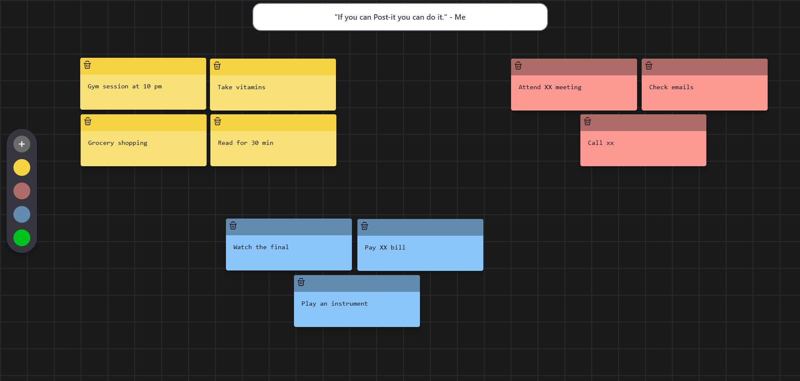
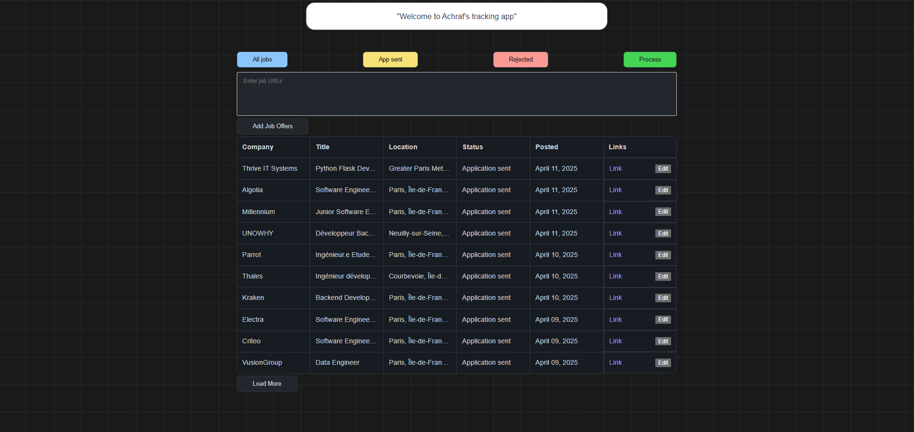
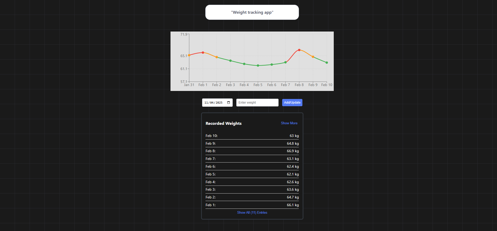

# Hi there! 👋

I'm **Achraf**, a Python Software Engineer passionate about building efficient and scalable solutions.  
I specialize in developing APIs, and implementing DevOps practices to deliver high-quality applications.

---

## 🚀 Client Projects
I work on multiple client projects delivering customized solutions tailored to specific business needs.

- Sticky notes app implemented using Python's FastApi (graphql API) & React:

- Job tracking app implemented using Python's FastApi (Rest API) & React:

- Weight app implemented using Python's Flask (Rest Api) & React:

## 🌟 Highlights
### Factset
- Creating a scalable, fast and cost-efficient job pipeline using Databricks.
- Built a unified Databricks pipeline to generate competitors for each of 4 Million company, streamlining and replacing a previously fragmented multi-cloud workflow.
- Cut end-to-end data processing from 28+ hours to under 3 hours (90%+ reduction, up to 10x faster).
- Automated data cleaning and deduplication, delivering ~97% cost reduction (from >$300/run to <$10/run) while elevating data quality.
- Expanded number of generated competitors per company from 100 to 1000.

### Société Générale
- Developed Python tools for automating network flow requests and user access with RBAC, enhancing operational efficiency.
- Refactored legacy Python applications from 2.7 to 3.11, improving maintainability and performance.
- Expertise in Docker, Kubernetes, and CI/CD pipelines with GitHub Actions.

---

## 🛠 Skills
- **Programming**: Python, React, SQL, PL/SQL, NoSQL

- **Data Engineering & Platforms**: Apache Spark, Delta Lake, Databricks (SQL, Unity Catalog, Jobs, Compute, Model Serving), Workflow Orchestration

- **Machine Learning & AI**: MLflow, Vector Databases (FAISS, Mosaic), BERT, Transformer Models, OCR, GPU Compute

- **DevOps**: Docker, Kubernetes, Ansible, Jenkins, GitHub Actions

- **Languages**: Fluent in French, English (TOEIC 880), Arabic

---

## 📫 Connect with Me
- Email: [achraf.bentaher.ing@gmail.com](mailto:achraf.bentaher.ing@gmail.com)
- LinkedIn: [linkedin.com/in/abentaher](https://linkedin.com/in/abentaher)
- GitHub: [github.com/Skypouk](https://github.com/Skypouk)
- LeetCode: [leetcode.com/u/skypouk](https://leetcode.com/u/skypouk)

---

🌱 Outside of work, I enjoy **reading**, playing the **piano**, **coding** personal projects and a variety of other sports and activities.
