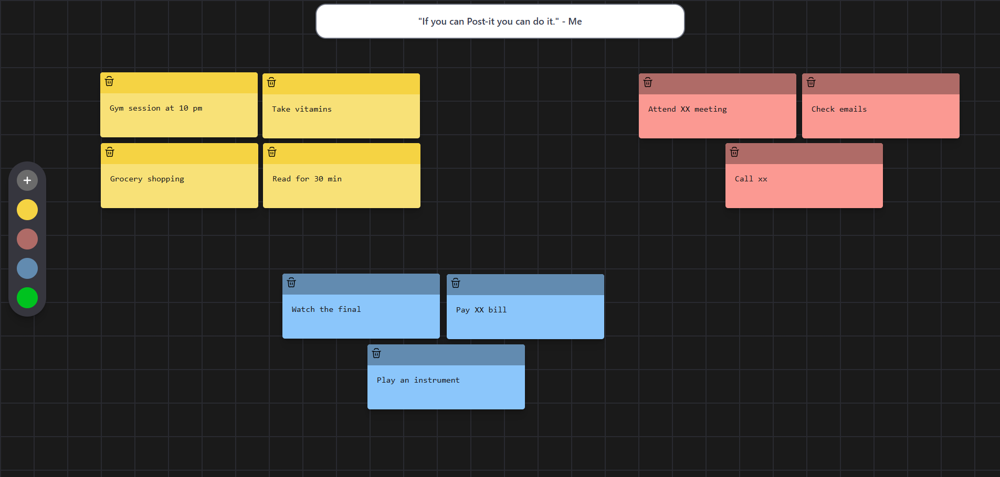
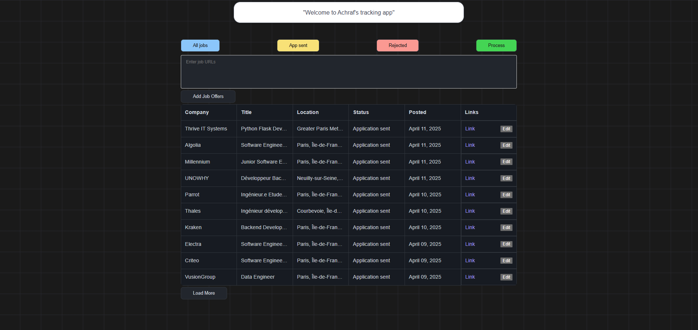
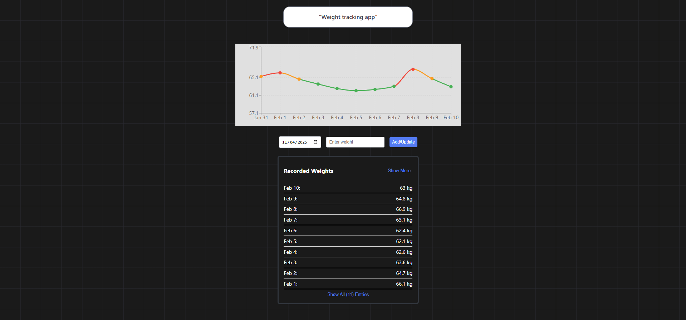

# Hi there! 👋

I'm **Achraf**, a Python Software Engineer passionate about building efficient and scalable solutions.  
I specialize in developing APIs, and implementing DevOps practices to deliver high-quality applications.

---

## 🚀 Client Projects
I work on multiple client projects delivering customized solutions tailored to specific business needs.

- Sticky notes app implemented using Python's FastApi (graphql API) & React:

- Job tracking app implemented using Python's FastApi (Rest API) & React:

- Weight app implemented using Python's Flask (Rest Api) & React:

## 🌟 Highlights
- Developed Python tools for automating network flow requests and user access with RBAC, enhancing operational efficiency.
- Refactored legacy Python applications from 2.7 to 3.11, improving maintainability and performance.
- Expertise in Docker, Kubernetes, and CI/CD pipelines with GitHub Actions.

---

## 🛠 Skills
- **Programming**: Python, React, SQL, PL/SQL, NoSQL
- **DevOps**: Docker, Kubernetes, Ansible, Jenkins, GitHub Actions
- **Data Science**: BERT, Transformer models, OCR
- **Languages**: Fluent in French, English (TOEIC 880), Arabic

---

## 📫 Connect with Me
- Email: [achraf.bentaher.ing@gmail.com](mailto:achraf.bentaher.ing@gmail.com)
- LinkedIn: [linkedin.com/in/abentaher](https://linkedin.com/in/abentaher)
- Portfolio: [skypouk.me](https://skypouk.me)
- GitHub: [github.com/Skypouk](https://github.com/Skypouk)
- LeetCode: [leetcode.com/u/skypouk](https://leetcode.com/u/skypouk)

---

🌱 Outside of work, I enjoy **reading**, playing the **piano**, **coding** personal projects and a variety of other sports and activities.
